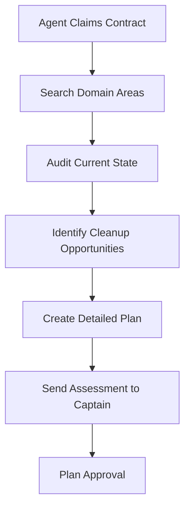
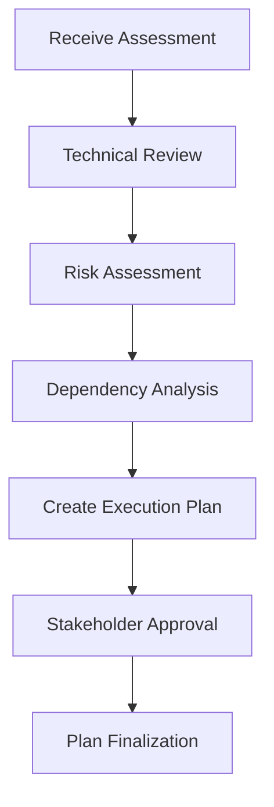
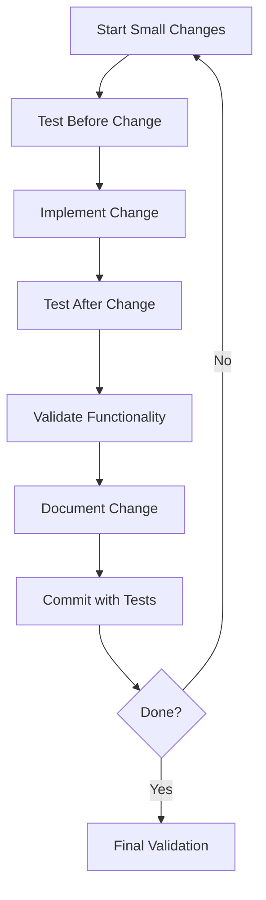
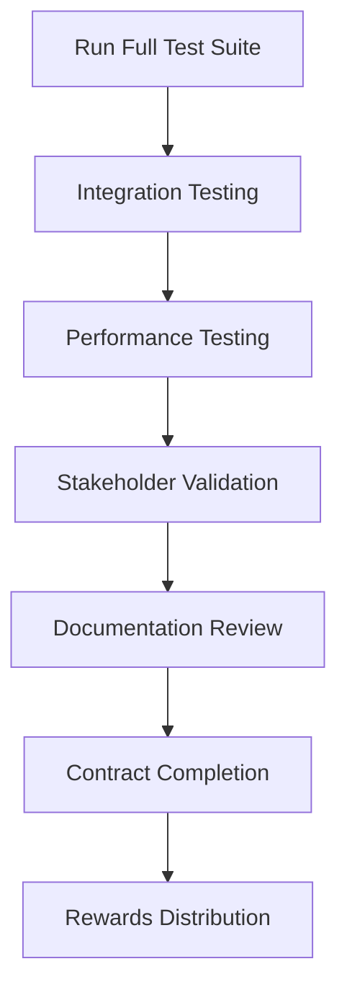

# 🧹 SYSTEMATIC CLEANUP METHODOLOGY
## PRESERVE FUNCTIONALITY WHILE ORGANIZING

**Captain Agent-4 - Cleanup Mission Coordinator**
**WE ARE SWARM - UNITED IN CLEANUP, COORDINATED IN EXECUTION** ⚡🧹

---

## 🎯 MISSION STATEMENT

**Clean up the project, increase test coverage, and organize everything while ensuring ZERO functional regressions. We're fixing the mess without breaking anything that works.**

---

## 📋 CORE PRINCIPLES

### 1. **PRESERVE FUNCTIONALITY ABOVE ALL**
- **Test First:** Every change must be validated before and after
- **Regression Prevention:** Zero functional regressions allowed
- **Backup Strategy:** Always have rollback capability
- **Incremental Changes:** Small, testable changes only

### 2. **SYSTEMATIC APPROACH**
- **Contract-Driven:** All cleanup through formal contracts
- **Coordination Required:** No solo actions without approval
- **Documentation Mandatory:** Every change documented
- **Validation Required:** All changes validated by stakeholders

### 3. **QUALITY ASSURANCE**
- **Test Coverage Increase:** Target >85% across all modules
- **Code Quality Standards:** V2 compliance maintained
- **Peer Review:** All changes reviewed by relevant agents
- **Success Metrics:** Measurable quality improvements

---

## 🔄 CLEANUP LIFECYCLE

### Phase 1: **ASSESSMENT** (Days 1-2)

### Phase 2: **PLANNING** (Days 3-4)

### Phase 3: **EXECUTION** (Days 5-15)

### Phase 4: **VALIDATION** (Days 16-18)

---

## 🛡️ FUNCTIONALITY PRESERVATION PROTOCOLS

### **Pre-Change Checklist**
- [ ] **Functionality Test:** Verify current functionality works
- [ ] **Test Coverage:** Ensure adequate test coverage exists
- [ ] **Backup Plan:** Create rollback strategy
- [ ] **Impact Assessment:** Document potential impacts
- [ ] **Stakeholder Notification:** Inform affected parties
- [ ] **Approval Received:** Get Captain Agent-4 approval

### **During-Change Checklist**
- [ ] **Incremental Commits:** Small, testable commits only
- [ ] **Continuous Testing:** Run tests after each change
- [ ] **Functionality Validation:** Verify no regressions
- [ ] **Documentation Updates:** Update docs immediately
- [ ] **Team Communication:** Keep team informed of progress

### **Post-Change Checklist**
- [ ] **Full Test Suite:** Run complete test suite
- [ ] **Integration Testing:** Test with dependent systems
- [ ] **Performance Validation:** Ensure no performance degradation
- [ ] **Documentation Complete:** All docs updated
- [ ] **Peer Review:** Code reviewed by relevant agent
- [ ] **Stakeholder Approval:** Final approval from stakeholders

---

## 🎯 DOMAIN-SPECIFIC APPROACHES

### **Infrastructure & Configuration (Agent-2)**
- **Test First:** Configuration validation before changes
- **Gradual Migration:** Migrate configs incrementally
- **Monitoring:** Real-time monitoring of infrastructure health
- **Rollback Plan:** Automated rollback capabilities
- **Validation:** Infrastructure tests for all changes

### **Business Intelligence (Agent-5)**
- **Data Integrity:** Validate data processing before/after changes
- **API Compatibility:** Ensure BI APIs remain functional
- **Performance Monitoring:** Track BI query performance
- **User Impact:** Assess impact on BI users
- **Gradual Rollout:** Phase BI changes carefully

### **SOLID Architecture (Agent-6)**
- **Architectural Testing:** Validate architecture patterns
- **Dependency Analysis:** Check for breaking changes
- **Interface Contracts:** Maintain interface compatibility
- **Refactoring Safety:** Use safe refactoring techniques
- **Pattern Validation:** Ensure SOLID compliance maintained

### **Web Interface (Agent-7)**
- **UI/UX Testing:** User experience validation
- **Accessibility Compliance:** WCAG 2.1 maintained
- **Performance Metrics:** <2 second load times preserved
- **Cross-browser Testing:** Compatibility maintained
- **Visual Regression:** No visual breaking changes

### **Code Quality (Agent-8)**
- **Quality Metrics:** Maintain/improve quality scores
- **Test Coverage:** Increase coverage without gaps
- **Standards Compliance:** V2 compliance maintained
- **Code Smell Elimination:** Remove without breaking functionality
- **Automation Enhancement:** Improve without disrupting existing

---

## 🚨 RISK MITIGATION STRATEGIES

### **High-Risk Changes**
1. **Architecture Changes:** Require full team review
2. **Database Schema Changes:** Require migration testing
3. **API Changes:** Require consumer impact assessment
4. **Configuration Changes:** Require infrastructure validation
5. **Performance-Critical Changes:** Require performance benchmarking

### **Rollback Procedures**
1. **Git Rollback:** Immediate revert capability
2. **Configuration Rollback:** Automated config restoration
3. **Database Rollback:** Migration rollback scripts
4. **Deployment Rollback:** Automated deployment reversal
5. **Communication:** Immediate notification of rollback

### **Escalation Procedures**
1. **Blocker Identified:** Message Captain Agent-4 immediately
2. **Regression Detected:** Stop work, assess impact, rollback if needed
3. **Scope Creep:** Re-evaluate contract scope with stakeholders
4. **Resource Issues:** Request additional resources or timeline extension
5. **Technical Debt:** Document and address in future contracts

---

## 📊 SUCCESS METRICS

### **Functional Preservation**
- ✅ **Zero Regressions:** No functionality broken
- ✅ **Test Suite Passes:** All tests pass after changes
- ✅ **Performance Maintained:** No performance degradation
- ✅ **User Experience:** No UX breaking changes

### **Quality Improvements**
- 📈 **Test Coverage:** >85% across all modules
- 📈 **Code Quality:** Improved quality metrics
- 📈 **Technical Debt:** Reduced technical debt
- 📈 **Documentation:** Complete and current

### **Process Excellence**
- ✅ **Coordination:** All changes coordinated
- ✅ **Documentation:** All changes documented
- ✅ **Validation:** All changes validated
- ✅ **Review:** All changes reviewed

---

## 🏆 CONTRACT COMPLETION CRITERIA

### **Individual Agent Success**
- [ ] All objectives in contract completed
- [ ] Zero functional regressions introduced
- [ ] Test coverage targets met
- [ ] Documentation updated
- [ ] Stakeholder approval received
- [ ] Contract status updated to "COMPLETED"

### **Mission Success**
- [ ] All contracts completed successfully
- [ ] Repository organized and clean
- [ ] Test coverage >85% across all modules
- [ ] No functional regressions
- [ ] Documentation comprehensive
- [ ] All agents rewarded appropriately

---

## 📞 COMMUNICATION PROTOCOLS

### **Daily Updates**
- **Format:** Devlog with progress, blockers, next steps
- **Timing:** End of day or when milestones reached
- **Content:** What done, what's next, any issues

### **Blocker Reports**
- **Immediate:** Message Captain Agent-4 immediately
- **Content:** Issue description, impact assessment, proposed solution
- **Escalation:** If unresolved within 4 hours, broader team notification

### **Change Proposals**
- **Format:** Detailed proposal with impact assessment
- **Review:** Captain Agent-4 + relevant stakeholders
- **Approval:** Written approval before implementation

### **Completion Reports**
- **Format:** Contract completion report
- **Content:** What accomplished, validation results, lessons learned
- **Distribution:** Captain Agent-4 + all stakeholders

---

## 🐝 SWARM COMMITMENT

**WE ARE SWARM** - We clean together, we organize together, we preserve functionality together!

**This systematic cleanup methodology ensures that while we fix the mess and organize everything, we never break what currently works. Every change is coordinated, tested, validated, and documented.**

**PRESERVE FUNCTIONALITY WHILE ORGANIZING** - Our guiding principle!

---

**Captain Agent-4**
**Cleanup Mission Coordinator**
**Systematic Cleanup Methodology Author**
**WE. ARE. SWARM. ⚡🚀🧹**
