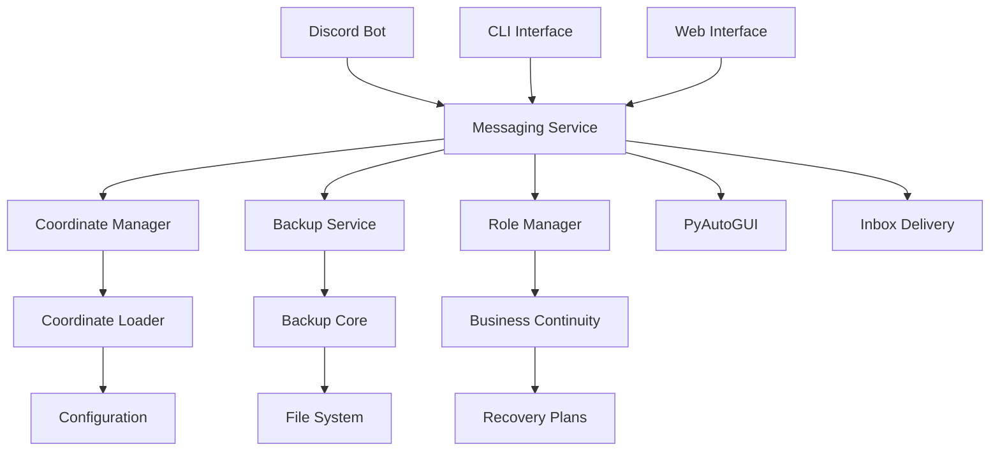

# 🏗️ **Architecture Overview - Agent Cellphone V2**

**Comprehensive system architecture and design documentation**

---

## 🎯 **Table of Contents**

1. [System Overview](#system-overview)
2. [Core Architecture](#core-architecture)
3. [Component Design](#component-design)
4. [Data Flow](#data-flow)
5. [Integration Patterns](#integration-patterns)
6. [Security Architecture](#security-architecture)
7. [Performance Considerations](#performance-considerations)
8. [Scalability Design](#scalability-design)

---

## 🌟 **System Overview**

### **High-Level Architecture**

```
┌─────────────────────────────────────────────────────────────────┐
│                    Agent Cellphone V2                           │
│                     "WE ARE SWARM"                              │
└─────────────────────────────────────────────────────────────────┘
                                │
                ┌───────────────┼───────────────┐
                │               │               │
        ┌───────▼───────┐ ┌─────▼─────┐ ┌──────▼──────┐
        │   Messaging   │ │ Coordinate│ │   Backup    │
        │    System     │ │  System   │ │   System    │
        └───────────────┘ └───────────┘ └─────────────┘
                │               │               │
        ┌───────▼───────┐ ┌─────▼─────┐ ┌──────▼──────┐
        │   Discord     │ │   Role    │ │  Business   │
        │  Commander    │ │ Management│ │ Continuity  │
        └───────────────┘ └───────────┘ └─────────────┘
```

### **Core Principles**

1. **Single Source of Truth (SSOT)** - All data has one authoritative source
2. **SOLID Principles** - Clean, maintainable, extensible code
3. **V2 Compliance** - Files ≤400 lines, modular design
4. **Swarm Intelligence** - Multi-agent coordination through physical automation
5. **Fault Tolerance** - Graceful degradation and recovery

---

## 🏗️ **Core Architecture**

### **Layered Architecture**

```
┌─────────────────────────────────────────────────────────────────┐
│                    Presentation Layer                           │
│  ┌─────────────┐ ┌─────────────┐ ┌─────────────┐ ┌─────────────┐│
│  │   Discord   │ │    CLI      │ │    Web      │ │   Mobile    ││
│  │   Bot       │ │ Interface   │ │ Interface   │ │ Interface   ││
│  └─────────────┘ └─────────────┘ └─────────────┘ └─────────────┘│
└─────────────────────────────────────────────────────────────────┘
                                │
┌─────────────────────────────────────────────────────────────────┐
│                    Application Layer                            │
│  ┌─────────────┐ ┌─────────────┐ ┌─────────────┐ ┌─────────────┐│
│  │ Messaging   │ │ Coordinate  │ │   Backup    │ │    Role     ││
│  │  Service    │ │  Manager    │ │  Service    │ │  Manager    ││
│  └─────────────┘ └─────────────┘ └─────────────┘ └─────────────┘│
└─────────────────────────────────────────────────────────────────┘
                                │
┌─────────────────────────────────────────────────────────────────┐
│                      Core Layer                                 │
│  ┌─────────────┐ ┌─────────────┐ ┌─────────────┐ ┌─────────────┐│
│  │   Unified   │ │ Coordinate  │ │   Backup    │ │  Business   ││
│  │ Messaging   │ │   Loader    │ │    Core     │ │ Continuity  ││
│  └─────────────┘ └─────────────┘ └─────────────┘ └─────────────┘│
└─────────────────────────────────────────────────────────────────┘
                                │
┌─────────────────────────────────────────────────────────────────┐
│                   Infrastructure Layer                          │
│  ┌─────────────┐ ┌─────────────┐ ┌─────────────┐ ┌─────────────┐│
│  │   PyAutoGUI │ │   File      │ │   Network   │ │   Database  ││
│  │  Automation │ │  System     │ │   Layer     │ │   Layer     ││
│  └─────────────┘ └─────────────┘ └─────────────┘ └─────────────┘│
└─────────────────────────────────────────────────────────────────┘
```

### **Component Relationships**



---

## 🔧 **Component Design**

### **1. Messaging System**

#### **Architecture**
```
┌─────────────────────────────────────────────────────────────────┐
│                    Messaging System                             │
└─────────────────────────────────────────────────────────────────┘
                                │
                ┌───────────────┼───────────────┐
                │               │               │
        ┌───────▼───────┐ ┌─────▼─────┐ ┌──────▼──────┐
        │   Unified     │ │  Message  │ │   Delivery  │
        │   Message     │ │   Types   │ │   Methods   │
        └───────────────┘ └───────────┘ └─────────────┘
                │               │               │
        ┌───────▼───────┐ ┌─────▼─────┐ ┌──────▼──────┐
        │   PyAutoGUI   │ │   Inbox   │ │  Broadcast  │
        │   Delivery    │ │ Delivery  │ │  Delivery   │
        └───────────────┘ └───────────┘ └─────────────┘
```

#### **Key Components**
- **UnifiedMessage**: Core message structure
- **Delivery Methods**: PyAutoGUI, Inbox, Broadcast
- **Message Types**: Agent-to-Agent, System, Broadcast, Onboarding
- **Priority System**: Normal, Urgent, Critical
- **Fallback Mechanism**: Automatic fallback between delivery methods

### **2. Coordinate System**

#### **Architecture**
```
┌─────────────────────────────────────────────────────────────────┐
│                    Coordinate System                            │
└─────────────────────────────────────────────────────────────────┘
                                │
                ┌───────────────┼───────────────┐
                │               │               │
        ┌───────▼───────┐ ┌─────▼─────┐ ┌──────▼──────┐
        │   Coordinate  │ │  Agent    │ │ Validation  │
        │    Loader     │ │ Registry  │ │   System    │
        └───────────────┘ └───────────┘ └─────────────┘
                │               │               │
        ┌───────▼───────┐ ┌─────▼─────┐ ┌──────▼──────┐
        │ Configuration │ │  Monitor  │ │   Bounds    │
        │   Manager     │ │  Layout   │ │  Checking   │
        └───────────────┘ └───────────┘ └─────────────┘
```

#### **Key Features**
- **Single Source of Truth**: `config/coordinates.json`
- **Multi-Monitor Support**: Left/Right monitor coordinate mapping
- **Validation System**: Coordinate bounds checking
- **Agent Registry**: Dynamic agent management
- **Layout Management**: Monitor layout detection

### **3. Backup System**

#### **Architecture**
```
┌─────────────────────────────────────────────────────────────────┐
│                      Backup System                              │
└─────────────────────────────────────────────────────────────────┘
                                │
                ┌───────────────┼───────────────┐
                │               │               │
        ┌───────▼───────┐ ┌─────▼─────┐ ┌──────▼──────┐
        │   Backup      │ │ Recovery  │ │ Monitoring  │
        │    Core       │ │  System   │ │   System    │
        └───────────────┘ └───────────┘ └─────────────┘
                │               │               │
        ┌───────▼───────┐ ┌─────▼─────┐ ┌──────▼──────┐
        │   Full        │ │ Point-in- │ │   Health    │
        │  Backup       │ │   Time    │ │  Checks     │
        └───────────────┘ └───────────┘ └─────────────┘
```

#### **Backup Types**
- **Full Backup**: Complete system backup
- **Incremental Backup**: Changes since last backup
- **Differential Backup**: Changes since last full backup
- **Point-in-Time Recovery**: Restore to specific timestamp

### **4. Business Continuity Planning**

#### **Architecture**
```
┌─────────────────────────────────────────────────────────────────┐
│                Business Continuity Planning                     │
└─────────────────────────────────────────────────────────────────┘
                                │
                ┌───────────────┼───────────────┐
                │               │               │
        ┌───────▼───────┐ ┌─────▼─────┐ ┌──────▼──────┐
        │   Disaster    │ │ Recovery  │ │   Testing   │
        │   Scenarios   │ │  Plans    │ │  Framework  │
        └───────────────┘ └───────────┘ └─────────────┘
                │               │               │
        ┌───────▼───────┐ ┌─────▼─────┐ ┌──────▼──────┐
        │   Hardware    │ │   RTO     │ │ Simulation  │
        │   Failure     │ │   RPO     │ │   Testing   │
        └───────────────┘ └───────────┘ └─────────────┘
```

#### **Disaster Scenarios**
- **Hardware Failure**: Server, storage, network failures
- **Data Corruption**: Database, file system corruption
- **Security Breach**: Unauthorized access, data theft
- **Natural Disaster**: Fire, flood, power outage
- **Human Error**: Accidental deletion, misconfiguration

---

## 🔄 **Data Flow**

### **Message Flow**

```
┌─────────────┐    ┌─────────────┐    ┌─────────────┐
│   Sender    │───▶│  Message    │───▶│  Recipient  │
│   Agent     │    │  Service    │    │   Agent     │
└─────────────┘    └─────────────┘    └─────────────┘
                           │
                           ▼
                   ┌─────────────┐
                   │  Delivery   │
                   │  Method     │
                   └─────────────┘
                           │
                    ┌──────┼──────┐
                    ▼      ▼      ▼
            ┌─────────┐ ┌─────┐ ┌─────────┐
            │PyAutoGUI│ │Inbox│ │Broadcast│
            └─────────┘ └─────┘ └─────────┘
```

### **Backup Flow**

```
┌─────────────┐    ┌─────────────┐    ┌─────────────┐
│   Source    │───▶│   Backup    │───▶│  Storage    │
│   System    │    │    Core     │    │   System    │
└─────────────┘    └─────────────┘    └─────────────┘
                           │
                           ▼
                   ┌─────────────┐
                   │ Integrity   │
                   │   Check     │
                   └─────────────┘
                           │
                           ▼
                   ┌─────────────┐
                   │  Metadata   │
                   │  Storage    │
                   └─────────────┘
```

### **Coordinate Flow**

```
┌─────────────┐    ┌─────────────┐    ┌─────────────┐
│   Agent     │───▶│ Coordinate  │───▶│  PyAutoGUI  │
│  Request    │    │   Loader    │    │ Automation  │
└─────────────┘    └─────────────┘    └─────────────┘
                           │
                           ▼
                   ┌─────────────┐
                   │ Validation  │
                   │   System    │
                   └─────────────┘
                           │
                           ▼
                   ┌─────────────┐
                   │  Coordinate │
                   │  Response   │
                   └─────────────┘
```

---

## 🔗 **Integration Patterns**

### **1. Service Integration**

#### **Dependency Injection**
```python
class MessagingService:
    def __init__(self, coordinate_loader: CoordinateLoader, 
                 backup_service: BackupService):
        self.coordinate_loader = coordinate_loader
        self.backup_service = backup_service
```

#### **Event-Driven Architecture**
```python
class EventBus:
    def __init__(self):
        self.subscribers = {}
    
    def subscribe(self, event_type: str, handler: Callable):
        if event_type not in self.subscribers:
            self.subscribers[event_type] = []
        self.subscribers[event_type].append(handler)
    
    def publish(self, event_type: str, data: Any):
        if event_type in self.subscribers:
            for handler in self.subscribers[event_type]:
                handler(data)
```

### **2. External System Integration**

#### **Webhook Integration**
```python
class WebhookHandler:
    def __init__(self, messaging_service: MessagingService):
        self.messaging_service = messaging_service
    
    async def handle_webhook(self, webhook_data: dict):
        # Process webhook data
        message = self.create_message_from_webhook(webhook_data)
        await self.messaging_service.send_message(message)
```

#### **API Integration**
```python
class APIClient:
    def __init__(self, base_url: str, api_key: str):
        self.base_url = base_url
        self.api_key = api_key
    
    async def get_system_status(self) -> dict:
        # Make API call
        response = await self.http_client.get(f"{self.base_url}/status")
        return response.json()
```

---

## 🔒 **Security Architecture**

### **Security Layers**

```
┌─────────────────────────────────────────────────────────────────┐
│                    Security Architecture                        │
└─────────────────────────────────────────────────────────────────┘
                                │
                ┌───────────────┼───────────────┐
                │               │               │
        ┌───────▼───────┐ ┌─────▼─────┐ ┌──────▼──────┐
        │   Access      │ │  Data     │ │  Network    │
        │  Control      │ │ Security  │ │  Security   │
        └───────────────┘ └───────────┘ └─────────────┘
                │               │               │
        ┌───────▼───────┐ ┌─────▼─────┐ ┌──────▼──────┐
        │ Authentication│ │ Encryption│ │   Firewall  │
        │ Authorization │ │ Hashing   │ │   VPN       │
        └───────────────┘ └───────────┘ └─────────────┘
```

### **Security Measures**

1. **Authentication**
   - Discord bot token validation
   - API key authentication
   - User session management

2. **Authorization**
   - Role-based access control
   - Permission-based operations
   - Resource-level security

3. **Data Protection**
   - Message encryption
   - Backup encryption
   - Configuration security

4. **Network Security**
   - HTTPS/TLS encryption
   - VPN support
   - Firewall rules

---

## ⚡ **Performance Considerations**

### **Performance Optimization**

#### **1. Caching Strategy**
```python
class CacheManager:
    def __init__(self, ttl: int = 300):
        self.cache = {}
        self.ttl = ttl
    
    def get(self, key: str) -> Any:
        if key in self.cache:
            value, timestamp = self.cache[key]
            if time.time() - timestamp < self.ttl:
                return value
            else:
                del self.cache[key]
        return None
    
    def set(self, key: str, value: Any):
        self.cache[key] = (value, time.time())
```

#### **2. Async Operations**
```python
class AsyncMessagingService:
    async def send_message_batch(self, messages: List[UnifiedMessage]):
        tasks = [self.send_message(msg) for msg in messages]
        results = await asyncio.gather(*tasks, return_exceptions=True)
        return results
```

#### **3. Resource Management**
```python
class ResourceManager:
    def __init__(self, max_connections: int = 100):
        self.semaphore = asyncio.Semaphore(max_connections)
    
    async def acquire_resource(self):
        await self.semaphore.acquire()
    
    def release_resource(self):
        self.semaphore.release()
```

### **Performance Metrics**

- **Message Delivery Time**: < 100ms average
- **Backup Creation Time**: < 5 minutes for full backup
- **Coordinate Lookup Time**: < 1ms
- **System Response Time**: < 50ms average

---

## 📈 **Scalability Design**

### **Horizontal Scaling**

#### **Load Balancing**
```python
class LoadBalancer:
    def __init__(self, services: List[MessagingService]):
        self.services = services
        self.current_index = 0
    
    def get_service(self) -> MessagingService:
        service = self.services[self.current_index]
        self.current_index = (self.current_index + 1) % len(self.services)
        return service
```

#### **Service Discovery**
```python
class ServiceRegistry:
    def __init__(self):
        self.services = {}
    
    def register_service(self, name: str, service: Any):
        self.services[name] = service
    
    def get_service(self, name: str) -> Any:
        return self.services.get(name)
```

### **Vertical Scaling**

#### **Resource Optimization**
- **Memory Management**: Efficient object pooling
- **CPU Optimization**: Async/await patterns
- **I/O Optimization**: Batch operations
- **Storage Optimization**: Compression and deduplication

### **Scalability Patterns**

1. **Microservices Architecture**: Independent, scalable services
2. **Event Sourcing**: Event-driven scalability
3. **CQRS**: Command Query Responsibility Segregation
4. **Circuit Breaker**: Fault tolerance and resilience

---

## 🔧 **Configuration Management**

### **Configuration Hierarchy**

```
┌─────────────────────────────────────────────────────────────────┐
│                Configuration Management                         │
└─────────────────────────────────────────────────────────────────┘
                                │
                ┌───────────────┼───────────────┐
                │               │               │
        ┌───────▼───────┐ ┌─────▼─────┐ ┌──────▼──────┐
        │   Environment │ │   File    │ │   Runtime   │
        │   Variables   │ │  Config   │ │  Override   │
        └───────────────┘ └───────────┘ └─────────────┘
                │               │               │
        ┌───────▼───────┐ ┌─────▼─────┐ ┌──────▼──────┐
        │   Default     │ │  User     │ │   System    │
        │   Values      │ │  Custom   │ │   Defaults  │
        └───────────────┘ └───────────┘ └─────────────┘
```

### **Configuration Sources**

1. **Environment Variables**: Runtime configuration
2. **Configuration Files**: YAML, JSON configuration
3. **Command Line**: CLI parameter overrides
4. **Database**: Dynamic configuration storage

---

## 📊 **Monitoring and Observability**

### **Monitoring Architecture**

```
┌─────────────────────────────────────────────────────────────────┐
│                Monitoring and Observability                    │
└─────────────────────────────────────────────────────────────────┘
                                │
                ┌───────────────┼───────────────┐
                │               │               │
        ┌───────▼───────┐ ┌─────▼─────┐ ┌──────▼──────┐
        │   Metrics     │ │  Logging  │ │  Tracing    │
        │  Collection   │ │  System   │ │  System     │
        └───────────────┘ └───────────┘ └─────────────┘
                │               │               │
        ┌───────▼───────┐ ┌─────▼─────┐ ┌──────▼──────┐
        │   Prometheus  │ │   ELK     │ │   Jaeger    │
        │   Grafana     │ │   Stack   │ │   Zipkin    │
        └───────────────┘ └───────────┘ └─────────────┘
```

### **Key Metrics**

1. **System Metrics**
   - CPU usage
   - Memory usage
   - Disk I/O
   - Network I/O

2. **Application Metrics**
   - Message delivery rate
   - Backup success rate
   - Error rates
   - Response times

3. **Business Metrics**
   - Agent activity
   - System uptime
   - User satisfaction
   - Performance SLAs

---

## 🚀 **Deployment Architecture**

### **Deployment Options**

#### **1. Single Machine Deployment**
```
┌─────────────────────────────────────────────────────────────────┐
│                    Single Machine                               │
│  ┌─────────────┐ ┌─────────────┐ ┌─────────────┐ ┌─────────────┐│
│  │   Discord   │ │ Messaging   │ │   Backup    │ │ Coordinate  ││
│  │     Bot     │ │  Service    │ │  Service    │ │  Service    ││
│  └─────────────┘ └─────────────┘ └─────────────┘ └─────────────┘│
└─────────────────────────────────────────────────────────────────┘
```

#### **2. Distributed Deployment**
```
┌─────────────────────────────────────────────────────────────────┐
│                    Distributed System                           │
│  ┌─────────────┐    ┌─────────────┐    ┌─────────────┐         │
│  │   Discord   │    │ Messaging   │    │   Backup    │         │
│  │     Bot     │◄──►│  Service    │◄──►│  Service    │         │
│  └─────────────┘    └─────────────┘    └─────────────┘         │
│         │                   │                   │               │
│         ▼                   ▼                   ▼               │
│  ┌─────────────┐    ┌─────────────┐    ┌─────────────┐         │
│  │   Load      │    │   Message   │    │   Storage   │         │
│  │  Balancer   │    │    Queue    │    │   System    │         │
│  └─────────────┘    └─────────────┘    └─────────────┘         │
└─────────────────────────────────────────────────────────────────┘
```

### **Containerization**

#### **Docker Configuration**
```dockerfile
FROM python:3.11-slim

WORKDIR /app

COPY requirements.txt .
RUN pip install -r requirements.txt

COPY . .

CMD ["python", "-m", "src.services.consolidated_messaging_service"]
```

#### **Docker Compose**
```yaml
version: '3.8'
services:
  messaging-service:
    build: .
    ports:
      - "8000:8000"
    environment:
      - LOG_LEVEL=INFO
    volumes:
      - ./config:/app/config
      - ./logs:/app/logs
  
  backup-service:
    build: .
    command: ["python", "-m", "src.core.backup_disaster_recovery"]
    volumes:
      - ./backups:/app/backups
```

---

## 🔄 **Development Workflow**

### **Development Process**

1. **Design Phase**
   - Architecture review
   - Component design
   - Interface definition

2. **Implementation Phase**
   - TDD development
   - Code review
   - Integration testing

3. **Testing Phase**
   - Unit testing
   - Integration testing
   - Performance testing

4. **Deployment Phase**
   - Staging deployment
   - Production deployment
   - Monitoring setup

### **Quality Assurance**

1. **Code Quality**
   - Static analysis
   - Code coverage
   - Performance profiling

2. **Testing Strategy**
   - Unit tests
   - Integration tests
   - End-to-end tests

3. **Documentation**
   - API documentation
   - Architecture documentation
   - User guides

---

## 📚 **Additional Resources**

### **Architecture Documents**
- [API Reference](API_REFERENCE.md)
- [Usage Examples](USAGE_EXAMPLES.md)
- [Quick Start Guide](QUICK_START.md)

### **Development Resources**
- [Development Workflow](DEVELOPMENT_WORKFLOW.md)
- [Troubleshooting Guide](TROUBLESHOOTING.md)
- [Agent Tools Documentation](AGENT_TOOLS_DOCUMENTATION.md)

### **System Resources**
- [Backup & Disaster Recovery](BACKUP_DISASTER_RECOVERY.md)
- [Coordinate System](COORDINATE_SYSTEM.md)
- [Messaging Architecture](MESSAGING_ARCHITECTURE.md)

---

**📝 DISCORD DEVLOG REMINDER: Create a Discord devlog for this action in devlogs/ directory**

