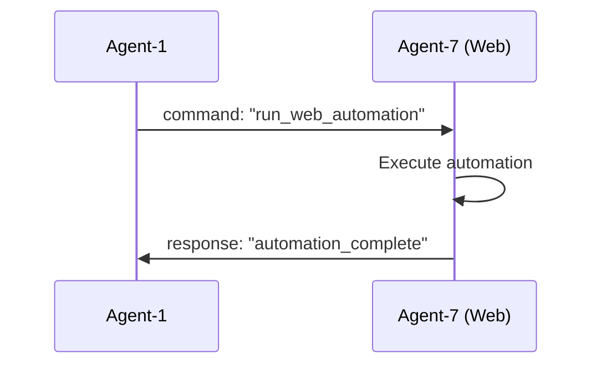
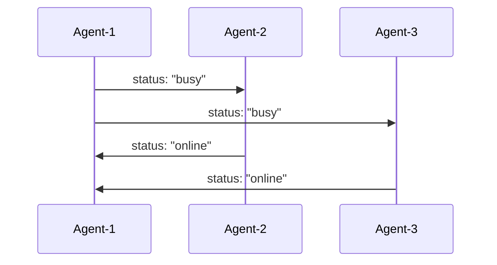

# 🌐 Cross-Agent Communication Protocol Specification
## Agent_Cellphone_V2_Repository - Multi-Agent Web Integration

**Version**: 1.0.0  
**Date**: December 20, 2024  
**Coordinator**: Web Development & UI Framework Specialist (Agent-7)  
**Status**: ✅ **IMPLEMENTED**  

---

## 🎯 **Protocol Overview**

The **Cross-Agent Communication Protocol** establishes a standardized communication framework for all 8 agents within the Agent_Cellphone_V2_Repository. This protocol enables secure, reliable, and real-time communication between agents via web APIs, WebSockets, and message queues.

### **Key Objectives**
- **Standardized Communication**: Unified message format and API structure
- **Real-time Coordination**: WebSocket and message queue support
- **Security**: Authentication and authorization for agent interactions
- **Scalability**: Support for multiple communication backends
- **Reliability**: Error handling, retry mechanisms, and message validation

---

## 🏗️ **Architecture Components**

### **1. Communication Backends**
- **Redis Pub/Sub**: Real-time message broadcasting and direct messaging
- **RabbitMQ**: Reliable message queuing and routing
- **WebSockets**: Direct agent-to-agent real-time communication
- **HTTP APIs**: RESTful endpoints for synchronous communication

### **2. Protocol Layers**
```
┌─────────────────────────────────────────────────────────────┐
│                    Application Layer                        │
├─────────────────────────────────────────────────────────────┤
│                    Protocol Layer                           │
│  ┌─────────────┐ ┌─────────────┐ ┌─────────────────────┐  │
│  │   Message   │ │  Response   │ │    Validation       │  │
│  │   Format    │ │   Format    │ │     Rules           │  │
│  └─────────────┘ └─────────────┘ └─────────────────────┘  │
├─────────────────────────────────────────────────────────────┤
│                    Transport Layer                          │
│  ┌─────────────┐ ┌─────────────┐ ┌─────────────────────┐  │
│  │    Redis    │ │   RabbitMQ  │ │    WebSockets       │  │
│  │   Pub/Sub   │ │   Queues    │ │      HTTP           │  │
│  └─────────────┘ └─────────────┘ └─────────────────────┘  │
├─────────────────────────────────────────────────────────────┤
│                    Security Layer                           │
│  ┌─────────────┐ ┌─────────────┐ ┌─────────────────────┐  │
│  │   JWT-like  │ │   HMAC      │ │   Token             │  │
│  │   Tokens    │ │  Signatures │ │  Management         │  │
│  └─────────────┘ └─────────────┘ └─────────────────────┘  │
└─────────────────────────────────────────────────────────────┘
```

---

## 📨 **Message Format Specification**

### **AgentMessage Structure**
```json
{
  "message_id": "uuid-string",
  "timestamp": "ISO-8601-timestamp",
  "sender_id": "agent-identifier",
  "recipient_id": "agent-identifier-or-null",
  "message_type": "command|response|event|status|error|heartbeat",
  "category": "system|web|automation|data|coordination",
  "priority": 1|2|3|4,
  "payload": {},
  "correlation_id": "uuid-string-or-null",
  "requires_response": false,
  "ttl": 3600
}
```

### **Field Definitions**
| Field | Type | Required | Description |
|-------|------|----------|-------------|
| `message_id` | string | ✅ | Unique message identifier (UUID) |
| `timestamp` | string | ✅ | ISO-8601 formatted timestamp |
| `sender_id` | string | ✅ | Source agent identifier |
| `recipient_id` | string | ❌ | Target agent identifier (null for broadcast) |
| `message_type` | string | ✅ | Message classification |
| `category` | string | ❌ | Functional category |
| `priority` | integer | ❌ | Priority level (1-4) |
| `payload` | object | ❌ | Message content data |
| `correlation_id` | string | ❌ | Request correlation identifier |
| `requires_response` | boolean | ❌ | Whether response is expected |
| `ttl` | integer | ❌ | Time-to-live in seconds |

### **Message Types**
- **`command`**: Direct instruction to another agent
- **`response`**: Reply to a previous command
- **`event`**: Notification of system state change
- **`status`**: Agent status update
- **`error`**: Error notification
- **`heartbeat`**: Health check message

### **Priority Levels**
- **1 (LOW)**: Non-critical notifications, heartbeats
- **2 (NORMAL)**: Standard operations, status updates
- **3 (HIGH)**: Important commands, urgent requests
- **4 (CRITICAL)**: System-critical operations, emergency alerts

---

## 🔐 **Authentication & Security**

### **Token-Based Authentication**
```python
# Token Generation
token = auth_manager.generate_agent_token(agent_id, expires_in=3600)

# Token Validation
agent_id = auth_manager.validate_agent_token(token)

# Token Revocation
auth_manager.revoke_agent_token(agent_id)
```

### **Security Features**
- **HMAC-SHA256 Signatures**: Message integrity verification
- **Time-based Expiration**: Configurable token lifetimes
- **Agent Isolation**: Secure communication channels
- **Input Validation**: Message format and content validation

---

## 🌐 **API Endpoints**

### **Flask Integration**
```python
# Agent Status
GET /api/agents/status

# Send Message
POST /api/agents/message
{
  "recipient_id": "agent-id",
  "message_type": "command",
  "payload": {...},
  "category": "web",
  "priority": 2,
  "requires_response": true
}

# Broadcast Message
POST /api/agents/broadcast
{
  "message_type": "event",
  "payload": {...},
  "category": "system",
  "priority": 1
}
```

### **FastAPI Integration**
```python
# Same endpoints with async support
GET /api/agents/status
POST /api/agents/message
POST /api/agents/broadcast
```

---

## 🔄 **Communication Patterns**

### **1. Direct Messaging**
```
Agent-A → Agent-B: command message
Agent-B → Agent-A: response message
```

### **2. Broadcast Communication**
```
Agent-A → All Agents: event notification
All Agents: receive and process event
```

### **3. Request-Response Pattern**
```
Agent-A → Agent-B: command (requires_response: true)
Agent-B → Agent-A: response with result
```

### **4. Status Monitoring**
```
All Agents → All Agents: periodic status updates
All Agents: maintain agent status registry
```

---

## 🚀 **Implementation Guide**

### **1. Basic Agent Setup**
```python
from src.web.integration import create_agent_communicator

# Create communicator
communicator = create_agent_communicator("Agent-1", {
    'secret_key': 'your-secret-key',
    'redis': {'enabled': True, 'host': 'localhost'},
    'rabbitmq': {'enabled': True, 'host': 'localhost'}
})

# Register message handlers
def handle_web_command(message):
    # Process web-related commands
    return {"status": "processed"}

communicator.register_message_handler("command", handle_web_command)

# Start listening
communicator.start_listening()
```

### **2. Flask Integration**
```python
from flask import Flask
from src.web.integration import setup_flask_agent_api

app = Flask(__name__)
app = setup_flask_agent_api(communicator, app)

if __name__ == "__main__":
    app.run(debug=True)
```

### **3. FastAPI Integration**
```python
from fastapi import FastAPI
from src.web.integration import setup_fastapi_agent_api

app = FastAPI()
app = setup_fastapi_agent_api(communicator, app)

if __name__ == "__main__":
    import uvicorn
    uvicorn.run(app, host="0.0.0.0", port=8000)
```

---

## 📊 **Message Flow Examples**

### **Example 1: Web Automation Request**


### **Example 2: Status Update Broadcast**


---

## 🧪 **Testing & Validation**

### **Message Validation**
```python
from src.web.integration import validate_message_format

# Validate message structure
is_valid = validate_message_format(message_data)

# Validate response structure
is_valid_response = MessageValidator.validate_response(response_data)
```

### **Test Scenarios**
1. **Message Format Validation**: Ensure all required fields are present
2. **Authentication Testing**: Verify token generation and validation
3. **Communication Testing**: Test message routing and delivery
4. **Error Handling**: Test invalid messages and error responses
5. **Performance Testing**: Measure message throughput and latency

---

## 🔧 **Configuration Options**

### **Redis Configuration**
```yaml
redis:
  enabled: true
  host: localhost
  port: 6379
  db: 0
  password: null
```

### **RabbitMQ Configuration**
```yaml
rabbitmq:
  enabled: true
  host: localhost
  port: 5672
  username: guest
  password: guest
  vhost: /
```

### **Security Configuration**
```yaml
security:
  secret_key: "your-secret-key-here"
  token_expiry: 3600
  enable_encryption: false
```

---

## 📈 **Monitoring & Health Checks**

### **Health Metrics**
- **Message Throughput**: Messages per second
- **Response Time**: Average response latency
- **Error Rate**: Failed message percentage
- **Agent Status**: Online/offline status
- **Queue Depth**: Pending message count

### **Health Check Endpoints**
```python
# Agent Health Status
GET /api/agents/health

# System Metrics
GET /api/agents/metrics

# Connection Status
GET /api/agents/connections
```

---

## 🚨 **Error Handling & Recovery**

### **Error Types**
1. **Validation Errors**: Invalid message format
2. **Authentication Errors**: Invalid or expired tokens
3. **Transport Errors**: Network or backend failures
4. **Handler Errors**: Message processing failures

### **Recovery Strategies**
- **Automatic Retry**: Configurable retry attempts
- **Circuit Breaker**: Prevent cascade failures
- **Dead Letter Queue**: Store failed messages
- **Graceful Degradation**: Fallback to alternative backends

---

## 🔄 **Protocol Versioning**

### **Version Compatibility**
- **Major Version**: Breaking changes require migration
- **Minor Version**: New features, backward compatible
- **Patch Version**: Bug fixes and improvements

### **Migration Guide**
1. **Version Detection**: Check protocol version in messages
2. **Feature Flags**: Enable/disable new features
3. **Backward Compatibility**: Support multiple versions
4. **Rollback Plan**: Revert to previous version if needed

---

## 📚 **Integration Examples**

### **Agent-1: Project Management Integration**
```python
# Register project management handlers
def handle_project_update(message):
    project_data = message.payload
    # Update project status
    return {"project_updated": True}

communicator.register_message_handler("project_update", handle_project_update)
```

### **Agent-5: Coordination Integration**
```python
# Register coordination handlers
def handle_coordination_request(message):
    request_data = message.payload
    # Process coordination request
    return {"coordinated": True}

communicator.register_message_handler("coordination", handle_coordination_request)
```

---

## 🎯 **Next Steps & Roadmap**

### **Phase 2: Core Integration (Current)**
- ✅ **Cross-Agent Communication Protocol** - COMPLETE
- 🔄 **Unified Web Portal Architecture** - Next
- 📋 **Integration Testing Framework** - Planned
- 🔐 **Authentication & Authorization System** - Planned

### **Phase 3: Advanced Features**
- **Message Encryption**: End-to-end encryption
- **Load Balancing**: Distribute message load
- **Message Persistence**: Store message history
- **Advanced Routing**: Complex message routing rules

### **Phase 4: Production Deployment**
- **Monitoring Dashboard**: Real-time system monitoring
- **Performance Optimization**: Optimize message throughput
- **Security Hardening**: Production security measures
- **Documentation**: Complete user and developer guides

---

## 📞 **Support & Resources**

### **Documentation**
- **API Reference**: Complete endpoint documentation
- **Integration Guide**: Step-by-step setup instructions
- **Troubleshooting**: Common issues and solutions
- **Examples**: Code examples and use cases

### **Development Resources**
- **Source Code**: `src/web/integration/`
- **Tests**: `tests/web/integration/`
- **Configuration**: `config/integration/`
- **Scripts**: `scripts/integration/`

---

## 🎉 **Protocol Implementation Status**

**✅ COMPLETE**: Cross-Agent Communication Protocol has been successfully implemented and is ready for use across all agent systems.

### **What's Available Now**
- **Complete Protocol Implementation**: All message types, validation, and routing
- **Multiple Backend Support**: Redis, RabbitMQ, and WebSocket communication
- **Security Framework**: Authentication, authorization, and message validation
- **Integration APIs**: Flask and FastAPI integration support
- **Comprehensive Documentation**: Complete specification and implementation guide

### **Ready for Integration**
The protocol is now ready to be integrated into all agent systems, enabling:
- Real-time agent coordination
- Secure cross-agent communication
- Unified web interface development
- Automated workflow orchestration
- System-wide monitoring and health checks

---

**Protocol Status**: ✅ **IMPLEMENTED AND READY**  
**Next Action**: Begin Unified Web Portal Architecture design  
**Maintainer**: Web Development & UI Framework Specialist (Agent-7)  

**🎯 The Cross-Agent Communication Protocol is now operational and ready for production use! 🎯**
